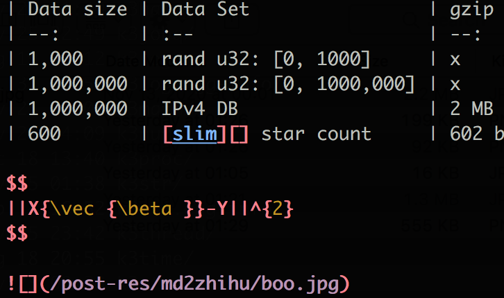

# md2zhihu

将 markdown 转换成 [知乎](zhihu.com) 兼容的 markdown 格式

[md2zhihu on Marketplace](https://github.com/marketplace/actions/md2zhihu)

|       | md源文件              | 导入知乎的效果          |
|:--    | :-:                   | :-:                     |
|使用前 |     |   |
|转换后 |  |    |

## Install

System requirement: MaxOS

```sh
# For rendering table to html
brew install pandoc imagemagick node
npm install -g @mermaid-js/mermaid-cli
```

```sh
pip install md2zhihu
```

## Usage

在git工作目录中:

```sh
md2zhihu your_great_work.md -r .
```

这个命令将markdown 转换成 知乎 文章编辑器可直接导入的格式,
存储到 `_md2/your_great_work.md`,
然后将图片等资源上传到**当前目录所在的git**的`_md2zhihu`分支.
转换后的markdown文档不依赖任何本地的图片文件或其他文件.

- `-d` 指定输出目录, 默认为`./_md2/`; 所有文章都会保存在这个目录中,
    名为`<article_name>` 的md转换之后保存在`_md2/zhihu/<article_name>/` 目录中,
    包括一个名为`<article_name>.md` 的md文件以及所有使用的图片等在同一个目录下.

    转换后所有输出内容将会push到`-r`指定的git repo中或当前目录下的git的repo中.

- `-r` 指定用于存储图片等资源的git repo url和上传的分支名; 要求是对这个repo有push权限.

    例如要将图片等上传到`github.com/openacid/foo`项目中的`bar`分支:
    ```
    md2zhihu great.md -r https://github.com/openacid/foo.git@bar
    ```

    默认使用当前目录下的git配置, (作者假设用户用git来保存自己的工作:DDD),
    如果没有指定分支名, md2zhihu 将建立一个`_md2zhihu_{cwd_tail}_{md5(cwd)[:8]}`的分支来保存所有图片.

<details>
<summary><b>排查问题</b></summary>

#### 找不到命令: 如 command not found: md2zhihu

看下这几个命令是否正常:

- `pip install --verbose md2zhihu` 安装时应该会提示按照成功的字样.
- `which md2zhihu` 如果能到应该会输出它的路径, 例如我的是安装在: `/Users/drdrxp/xp/py3virtual/p38/bin/md2zhihu`
- `echo $PATH` 确认安装的路径在PATH环境变量中: `...:/Users/drdrxp/xp/py3virtual/p38/bin:...`

</details>


## 使用 github-action 远程转换, 适合 Windows 用户

md2zhihu 不支持windows, 可以通过github-action来实现远程转换:

[md2zhihu on Marketplace](https://github.com/marketplace/actions/md2zhihu)


-   首先将要转换的 markdown 全部放在一个 github repo 中, 完成配置后, 每次 push 之后 github-action 将自动构建,
    例如 我自己的博客中的文章都在这个repo中: https://github.com/drmingdrmer/drmingdrmer.github.io

-   在文章 repo 中创建 action 描述文件, 定义一个 github-action,
    为每次 push 进行转换:
    `.github/workflows/md2zhihu.yml`, 内容为:

    ```yaml
    name: md2zhihu
    on: [push]
    jobs:
      md2zhihu:
        runs-on: ubuntu-latest
        steps:
        - uses: actions/checkout@v2
        - uses: drmingdrmer/md2zhihu@v0.10
          env:
            GITHUB_USERNAME: ${{ github.repository_owner }}
            GITHUB_TOKEN: ${{ secrets.GITHUB_TOKEN }}
          with:
            pattern: >
                _posts/*.md
                _posts/*.markdown
    ```
    然后将配置文件 commit 到 repo 中:
    `git add .github && git commit -m 'action: md2zhihu'`

    用以上配置, 在下一次push时, github action 将目录 `_posts/` 中所有的md文件进行转换,
    保存到目录`_md2zhihu` 中. 并在当前分支创建一个新提交点(`master-md2zhihu`),

    例如我的博客中文章装换后在:
    [single-file example](https://github.com/drmingdrmer/drmingdrmer.github.io/blob/master/_md2zhihu/dict-cmp.md)

-   要使用转换后的文档, 可以直接 merge 这个`master-md2zhihu`分支

    或直接从github repo 中访问, 例如:
    [single-file example](https://github.com/drmingdrmer/drmingdrmer.github.io/blob/master/_md2zhihu/dict-cmp.md)


## Features

- 公式转换:

  例如 ` $$ ||X{\vec {\beta }}-Y||^{2} $$ `
  
  转换成可以直接被知乎使用的tex渲染引擎的引用:

  ```
  
  ```

- 自动识别block的公式和inline的公式.

- 表格: 将markdown表格转换成html 以便支持知乎直接导入.

- 图片: md2zhihu 将图片上传到github, 并将markdown中的图片引用做替换.

- mermaid: 将mermaid语法渲染成图片, 并上传. 例如:

    ```mermaid
    graph LR
        A[Hard edge] -->|Link text| B(Round edge)
        B --> C{Decision}
        C -->|One| D[Result one]
        C -->|Two| E[Result two]
    ```

    转换成:

    


- graphviz: 将graphviz语法渲染成图片, 并上传. 例如:

    ```graphviz
    digraph R {
        node [shape=plaintext]
        rankdir=LR
        X0X0 [ label="0-0"]
        X0X0 -> X1X0 [ color="#aaaadd"]
        X0X0 -> X2X3 [ color="#aaaadd"]
    }
    ```

    转换成:

    


-   链接列表: 将 markdown 的 reference-style link 转成链接列表:

    | 源文件 | 转换后 | 导入后 |
    | :-: | :-: | :-: |
    |  |  |  |


## Limitation

- 知乎的表格不支持table cell 中的markdown格式, 例如表格中的超链接, 无法渲染, 会被知乎转成纯文本.
- md2zhihu 无法处理jekyll/github page的功能标签例如 ``. 这部分文本目前需要导入后手动删除或修改.
