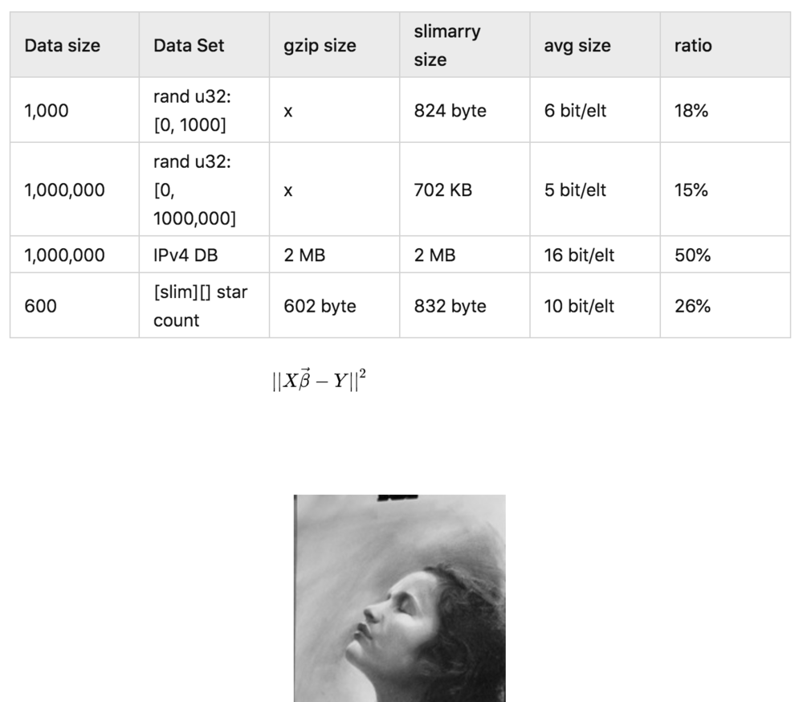

# md2zhihu

Converts markdown to a single-file version that has no local asset dependency
and can be imported into zhihu.com with just one click.

|           | md                    | imported               |
| :--       | :-:                   | :-:                    |
| original  |     |  |
| converted |  |   |

## Usage

Add action definition into the git repo you have markdowns to convert:
`.github/workflows/md2zhihu.yml`:

To create and add `GH_TOKEN`, see: [add-token](add-token.md)

```yaml
name: md2zhihu
on: [push]
jobs:
  md2zhihu:
    runs-on: ubuntu-latest
    steps:
    - uses: actions/checkout@v2
    - uses: drmingdrmer/md2zhihu@v0.4
      env:
        GITHUB_USERNAME: ${{ github.repository_owner }}
        GITHUB_TOKEN: ${{ secrets.GH_TOKEN }}
      with:
        pattern: >
            _posts/*.md
            _posts/*.markdown
```

The next push github converts markdowns in `_posts/` and stores converted
version in branch `_md2zhihu/md`.

E.g., the single-file version of all of my blog posts:
https://github.com/drmingdrmer/drmingdrmer.github.io/tree/_md2zhihu/md/_md2zhihu

To retrieve the converted markdowns, merge branch `_md2zhihu/md`,
or access the branch on the web:
https://github.com/drmingdrmer/drmingdrmer.github.io/blob/_md2zhihu/md/_md2zhihu/dict-cmp.md


### Options

-   `pattern`:

    file pattern to convert

    **required**: True
    **default**: `**/*.md`

-   `output_dir`:

    dir to store converted markdown

    **required**: True
    **default**: `_md2zhihu`

-   `md_branch`:

    The branch name to push converted markdown to. A build overrides previous built branch. If you want to persist the built markdowns, merge this branch.

    **required**: True
    **default**: `_md2zhihu/md`

-   `asset_branch`:

    The branch name in which assets are stored.

    **required**: True
    **default**: `_md2zhihu/asset`

-   `target_platform`:

    The platform that the converted markdown should be compatible to.
Currently supported platforms are zhihu, wechat, weibo, simple. `simple` converts almost everything to images and removes most text styles. E.g. inline code block is converted to normal text.

    **required**: True
    **default**: `zhihu`


## Use it Locally

System requirement: MaxOS

```sh
# For rendering table to html
brew install pandoc imagemagick node
npm install -g @mermaid-js/mermaid-cli
pip install md2zhihu
```

```sh
md2zhihu your_great_work.md
```

This command convert `your_great_work.md` to
`_md2/zhihu/your_great_work/your_great_work.md`.

## Features

- Transform latex to image:

  E.g. ` $$ ||X{\vec {\beta }}-Y||^{2} $$ ` is converted to 
  

  ```
  
  ```

- Transform table to html.

- Upload images.

- Transform mermaid code block to image:

    ```mermaid
    graph LR
        A[Hard edge] -->|Link text| B(Round edge)
        B --> C{Decision}
        C -->|One| D[Result one]
        C -->|Two| E[Result two]
    ```

    is converted to:

    

-   Generate link list::

    | original | converted | imported |
    | :-: | :-: | :-: |
    |  |  |  |


## Limitation

- zhihu.com does not support markdown syntax inside a table cell.
  These in-table-cell content are transformed to plain text.

- md2zhihu can not deal with jekyll/github page tags. E.g. ``.
